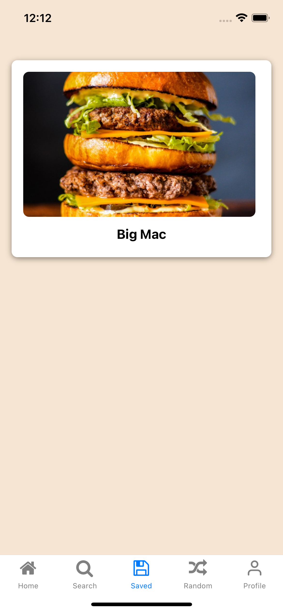
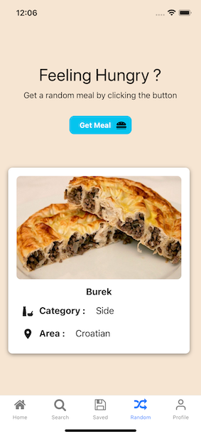
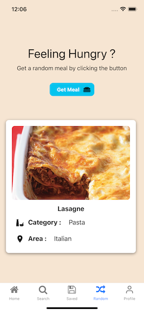
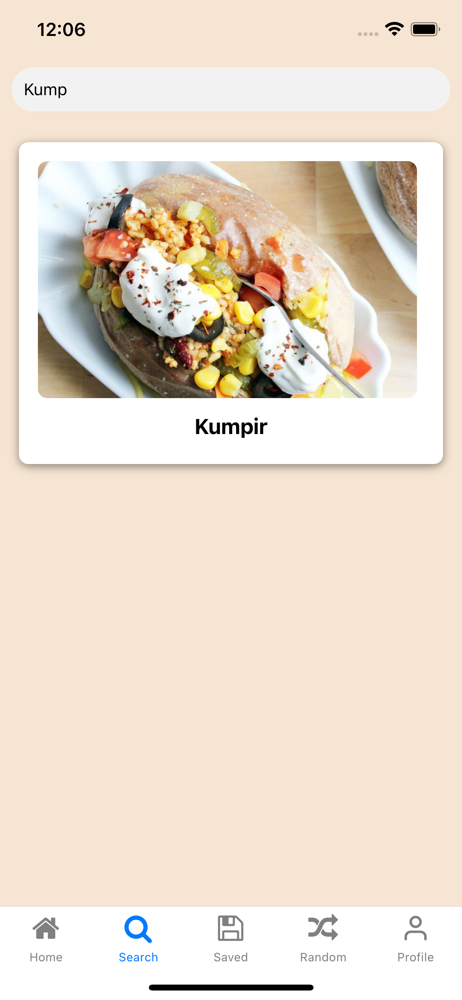
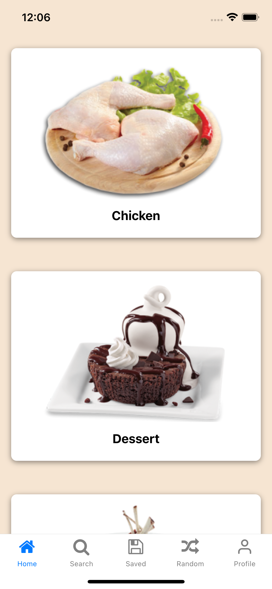
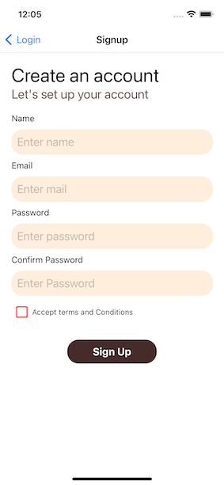
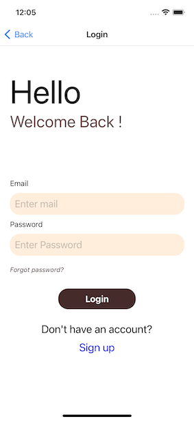
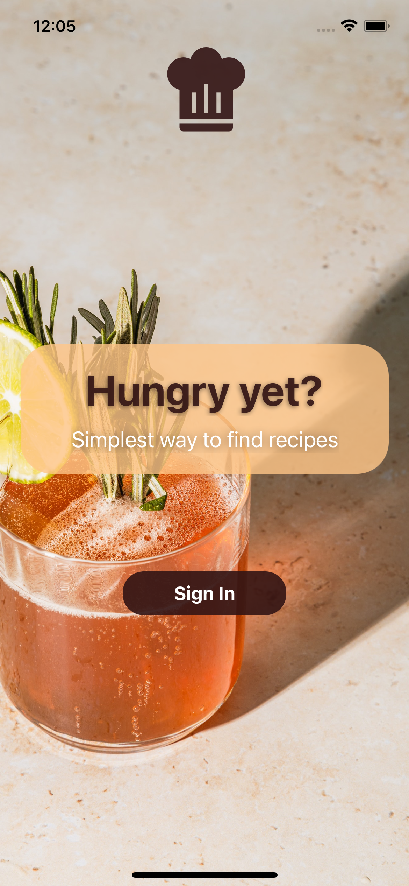

React Native Meal App 
===

###  Practical Meal Recipe Application
---
Save your favorite meals and search by their name or find them from their categories.

---
Features
---

* Data Fetching 
* Navigation (Main and Bottom Stack)
* Redux
* API 
* React Hooks
* Memoization
* Dark and Light Mode (theme)
* Firebase Authentication

---

